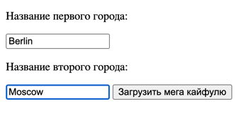

Я обработал основные возможные ошибки:
1) Пользователь вводит некорректное или несуществующее название
города. В таком случае его страница обновляется на страницу,
на которой я сообщаю ему об этой ошибке
2) Ответ сервера не поступает
3) Ошибка подключения к серверу (не удаётся авторизоваться
по данному api ключу
4) Сервер долго отвечает

Далее приведен пример работы приложения:

Другой случай:

Ошибка:

